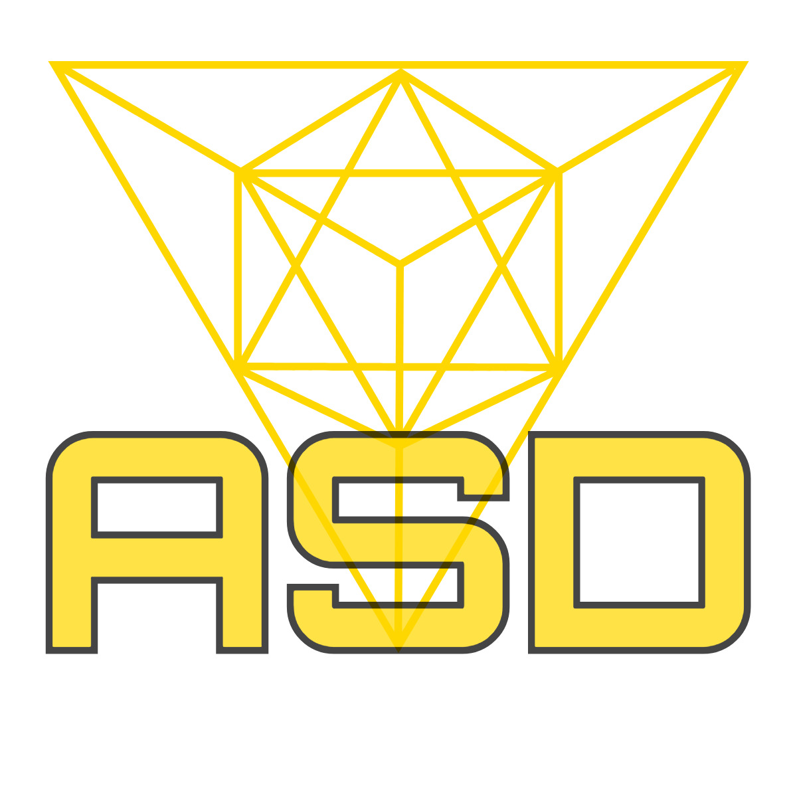

<h1 align="center">Welcome to Portefolio ASD 👋</h1>
<p>
  
</p>

 Mon portefolio de dev web

### 🏠 [Homepage](https://asdpf.netlify.app/)

# 💻 Tech Stack:

[](https://developer.mozilla.org/en-US/docs/Web/Guide/HTML/HTML5)
[](https://developer.mozilla.org/en-US/docs/Web/CSS)
[](https://developer.mozilla.org/en-US/docs/Web/JavaScript)
[](https://sass-lang.com/)
[](https://reactjs.org/)
[](https://git-scm.com/)
[](https://github.com/)

## Install

```sh
npm install
```

## Author

👤 **Sacha Darras**

[](https://github.com/sachdarras)
[](https://linkedin.com/in/sacha-darras)

## Show your support

Give a ⭐️ if this project helped you!

---

_This README was generated with ❤️ by [readme-md-generator](https://github.com/kefranabg/readme-md-generator)_
